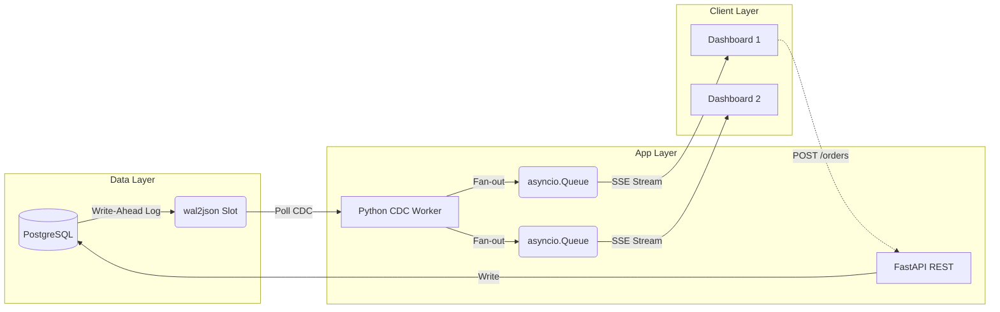

# Real-Time Order Tracking System

> **A production-grade CDC (Change Data Capture) pipeline delivering zero-polling, real-time database updates to connected clients.**


---

## ⚡ Quick Start

Start the entire stack (PostgreSQL, FastAPI Backend, Nginx Frontend) in just **3 commands**:

```bash
# 1. Clone the repository
git clone https://github.com/dishank31/Apt-Backend-Assignment.git
cd Apt-Backend-Assignment/backend

# 2. Configure Environment Variables
cp .env.example .env
# (Optional) Open .env and update the POSTGRES_PASSWORD if needed

# 3. Build and start the containers
docker-compose up --build -d

# 4. View the live dashboard
# Open http://localhost:3000 in your browser
```

| Resource | URL |
|:---|:---|
| **Real-Time Dashboard** | `http://localhost:3000` |
| **API Base URL** | `http://localhost:8000` |
| **Interactive API Docs** | `http://localhost:8000/docs` |

---

## 🎯 Problem Statement Criteria

This project was engineered specifically to meet and exceed the assessment criteria.

### 1. Database Changes
*Requirement: Any insert/update/delete on the `orders` table triggers an update.*
- **Implementation**: Utilizes **PostgreSQL Logical Decoding (`wal2json`)**. By reading the Write-Ahead Log (WAL) at the database engine level, the system captures **100% of mutations**—even if someone executes raw SQL directly via `psql`.

### 2. Client Updates
*Requirement: Clients get notified automatically with new data without polling.*
- **Implementation**: Employs **Server-Sent Events (SSE)**. The Python worker fans out WAL payloads into bounded asynchronous queues (`asyncio.Queue`) dedicated to each connected client. Updates stream instantly over a single, long-lived HTTP connection.

### 3. Tech Choices & Design Thinking
*Requirement: Consider scalability, efficiency, and justify tech choices.*
- **PostgreSQL WAL over Triggers**: Database triggers + `NOTIFY` degrade transaction performance and have an 8KB payload limit. WAL decoding is asynchronous, zero-impact on writes, and survives server restarts.
- **FastAPI over Node/Express**: Python's `asyncio` handles thousands of idle SSE connections concurrently. FastAPI provides automatic Pydantic data validation and OpenAPI doc generation.
- **SSE over WebSockets**: This is a unidirectional data flow (Server → Client). SSE is natively supported by browsers via `EventSource`, automatically handles reconnections, and traverses standard HTTP proxies without complex handshake overhead.

### 4. Code Quality & Resilience
- **Automated Testing**: Comprehensive integration test suite using `pytest` verifying CRUD operations and API boundaries.
- **Resilience**: The system auto-reconnects if the database goes down. The connection pool (`psycopg_pool`) intelligently handles transient network failures. Slow clients are evicted to prevent Out-Of-Memory (OOM) crashes.

---

## 🏗️ Architecture Overview

The pipeline strictly decouples the database engine, the API REST layer, and the real-time notification mechanism. 



For a deeper dive into the system mechanics and horizontal scaling strategies, see the [Architecture Document](docs/ARCHITECTURE.md). For endpoint specifications, see the [API Reference](docs/API.md).

---

## 👨‍💻 Author
**Dishank Gandhi**  
Developed for the APT Backend Engineering Assignment.
