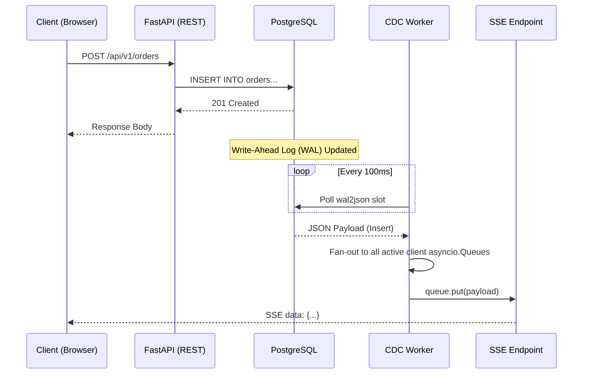

# Architecture Deep Dive

This document details the internal mechanics of the Change Data Capture (CDC) pipeline, outlining how database mutations flow from PostgreSQL to connected clients in real-time.

---

## 🔄 System Flow: Order Mutation to Client Notification

The pipeline guarantees that any change to the database—whether initiated by the API, a migration script, or a raw SQL query—is captured and broadcasted.



---

## 🗄️ WAL Payload Format

The logical replication slot decodes binary WAL entries into structured JSON via the `wal2json` plugin.

**Example `INSERT` Payload:**
```json
{
  "change": [
    {
      "kind": "insert",
      "schema": "public",
      "table": "orders",
      "columnnames": ["id", "customer_name", "product_name", "status", "updated_at"],
      "columnvalues": [1, "John Doe", "MacBook Pro", "pending", "2026-05-19 12:00:00"]
    }
  ]
}
```

**Example `UPDATE` Payload:**
Updates include the new values and the primary key (`oldkeys`) to identify the mutated row.
```json
{
  "change": [
    {
      "kind": "update",
      "table": "orders",
      "columnnames": ["id", "customer_name", "product_name", "status", "updated_at"],
      "columnvalues": [1, "John Doe", "MacBook Pro", "shipped", "2026-05-19 12:05:00"],
      "oldkeys": { "keynames": ["id"], "keytypes": ["integer"], "keyvalues": [1] }
    }
  ]
}
```

---

## 🏛️ Architectural Decision Records (ADRs)

### 1. WAL Logical Decoding vs. Triggers/NOTIFY
- **Decision:** Use `wal_level=logical` and `wal2json` instead of SQL Triggers and `pg_notify`.
- **Rationale:** 
  - `NOTIFY` has a hard 8KB payload limit, which complex rows can easily exceed.
  - Triggers execute synchronously during the transaction, slowing down database writes. WAL decoding is asynchronous.
  - Replication slots track read positions, ensuring zero data loss if the Python worker temporarily crashes.

### 2. Server-Sent Events (SSE) vs. WebSockets
- **Decision:** Use SSE for the real-time client transport.
- **Rationale:**
  - Order tracking is a strictly **unidirectional** data flow (Server to Client).
  - SSE uses standard HTTP, avoiding complex protocol handshakes, making it highly compatible with CDN and proxy configurations.
  - Browsers natively support SSE with the `EventSource` API, providing automatic reconnection logic out of the box.

### 3. Fan-out via Isolated Queues
- **Decision:** Each connected client receives a dedicated `asyncio.Queue` populated by a `put_nowait()` loop.
- **Rationale:** 
  - Prevents the "Slow Consumer Problem." If one client has a poor network connection, their specific queue fills up and drops events, without blocking the CDC worker from delivering payloads to healthy clients.

---

## 🚀 Scalability Trajectory

The current architecture is optimized for a single-node deployment supporting thousands of concurrent connections. To scale horizontally, the system is designed to evolve in clear steps.

### Step 1: Microservice Decoupling (Redis Pub/Sub)
When scaling FastAPI to multiple containers, the single CDC worker cannot maintain in-memory queues for clients connected to other instances.
- **Solution:** The CDC worker publishes the `wal2json` payload to a Redis Pub/Sub channel. Multiple FastAPI instances subscribe to this channel and fan-out updates to their locally connected SSE clients.

### Step 2: Event Sourcing & Guaranteed Delivery (Kafka)
When system demands require guaranteed delivery, replayability, and integration with data lakes.
- **Solution:** Replace the Python polling worker with **Debezium**, pushing WAL events directly into **Apache Kafka**. Microservices consume specific Kafka topics via consumer groups, ensuring strictly ordered, at-least-once delivery.
